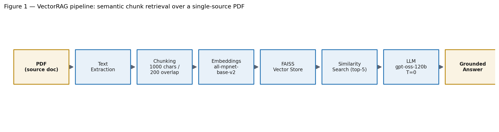
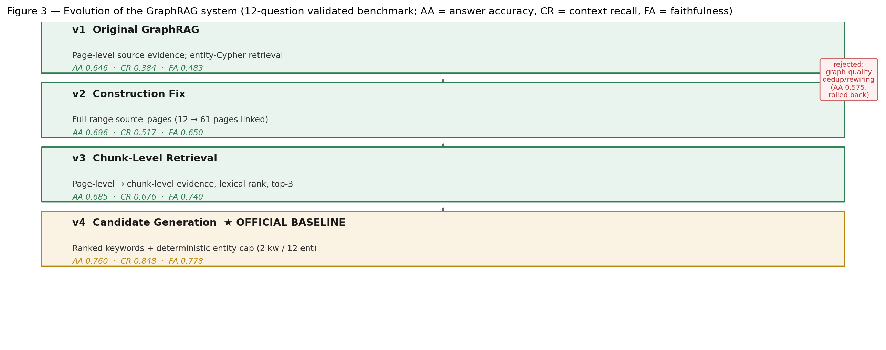

# GraphRAG vs VectorRAG for PDF Question Answering

### Final Project Report

**Author:** Anmol Pipara
**Date:** August 3, 2026

<!-- TOC -->

## Abstract

This project compares two Retrieval-Augmented Generation (RAG) paradigms — **VectorRAG** (semantic chunk retrieval with FAISS) and **GraphRAG** (knowledge-graph retrieval with Neo4j and Cypher) — on the same single-source document: the *ISO 20022 Payments Guide 2025* (61 pages, PDF). Both systems were evaluated with a **fully controlled harness**: identical QA model (`openai/gpt-oss-120b` via Groq, temperature 0.0), identical prompts, identical evaluator, and the same 12-question validated benchmark.

The GraphRAG system evolved through four isolated, evidence-driven versions: v1 (original page-level evidence), v2 (construction fix restoring full page provenance), v3 (chunk-level evidence selection), and v4 (candidate generation with ranked-keyword matching and deterministic entity ranking). Each experiment changed exactly one component and was gated by offline diagnostics before any benchmark spend.

**Results.** The final baseline, GraphRAG v4, is the first version to exceed VectorRAG on grounding quality: Context Recall **0.848 vs 0.776**, Faithfulness **0.778 vs 0.772**, and Hallucination Rate **0.222 vs 0.228** (lower is better). Over the original implementation (v1), v4 improved context recall by +0.464, faithfulness by +0.295, and hallucination rate by −0.295. VectorRAG still leads on answer-level metrics (Answer Accuracy 0.815 vs 0.760, Citation Correctness 0.794 vs 0.769, Context Precision 0.093 vs 0.073).

**Conclusion.** Retrieval engineering substantially improved GraphRAG's grounding quality and closed the previously dominant evidence-reachability bottleneck. The remaining gap to VectorRAG sits in answer generation and citation precision — not in retrieval — and the project has reached a scientifically defensible stopping point for further in-sample retrieval iterations.

## Introduction

### Retrieval-Augmented Generation (RAG)

RAG is an architecture that combines a **retriever** with a **generative large language model (LLM)**. Instead of answering from parametric memory alone, a RAG system first retrieves relevant passages or knowledge-graph facts from an external knowledge source and feeds them to the LLM as context, so the answer is grounded in the retrieved evidence. RAG provides three practical benefits: **hallucination control** (answers are anchored to real source text), **fresh/private knowledge** (documents the model has never seen can be queried without retraining), and **auditability** (every claim can be traced to a source passage or page).

### VectorRAG

VectorRAG is the standard semantic-search variant. The document is split into chunks, each chunk is embedded into a high-dimensional vector with a sentence-transformer model, and the chunks are stored in a vector database (FAISS). At query time the question is embedded and the top-k most similar chunks are retrieved by cosine similarity and passed to the LLM. It is simple, robust, and retrieval is broad: it freely retrieves full chunks of related text.

### GraphRAG

GraphRAG builds a **knowledge graph** from the document: an LLM extracts typed **entities** and **relationships**, which are deduplicated and loaded into **Neo4j**. At query time the system matches question entities to graph nodes, generates a **Cypher** query (with a deterministic fallback), and attaches the **source text** that the matched entities were extracted from. Retrieval is therefore graph-grounded: evidence is selected through entity identity and provenance rather than raw text similarity.

### Motivation

RAG quality is dominated by *which evidence reaches the LLM*. VectorRAG's advantage is broad coverage; GraphRAG's theoretical advantage is precision and multi-hop reasoning through relationships. The empirical question this project answers is: **on a real, single-source PDF, which retrieval paradigm produces more accurate, faithful, and better-cited answers — and can GraphRAG's known weaknesses (evidence reachability) be fixed through isolated engineering?**

## System Architecture

Both systems share the same source document, extraction layer, QA model, and evaluation harness. The only difference is the retrieval method.

**Figure 1 — VectorRAG pipeline.** Semantic chunk retrieval over the source PDF.

| Stage | Implementation |
|---|---|
| Extraction | Per-page text with `[PAGE N]` markers (`graph_rag/pdf_extractor.py`) |
| Chunking | Recursive character split, chunk size 1000, overlap 200 (`vector_rag/chunker.py`) |
| Embedding | `sentence-transformers/all-mpnet-base-v2`, cosine normalization |
| Vector store | FAISS, top-k = 5 (`vector_rag/vectorstore.py`, `retriever.py`) |
| Generation | `openai/gpt-oss-120b` via Groq, temperature 0.0, same prompt as GraphRAG |

**Figure 2 — GraphRAG pipeline.** Offline knowledge-graph construction and online, graph-grounded retrieval (v4 candidate generation).

| Stage | Implementation |
|---|---|
| Extraction | Same per-page extractor; 61 pages, 92,672 characters |
| Chunking | Section-based semantic batches, 3000 chars, 500 overlap → 35 chunks |
| Entity extraction | LLM per chunk, 46 typed entity schema types, 1,549 raw instances |
| Relationship extraction | LLM per chunk, 113 typed relation types, 1,038 raw instances |
| Refinement | Deterministic ID-based merge → 1,046 entities, 931 relationships |
| Graph store | Neo4j, 1,046 nodes / 878 relationships, schema indexes + constraints |
| Candidate generation (v4) | Ranked-keyword matching + deterministic entity ranking, cap 12 |
| Chunk retrieval | Lexical chunk ranking, top-3 chunks × 1,200 chars |
| Generation | `openai/gpt-oss-120b` via Groq, temperature 0.0, same prompt as VectorRAG |

## Implementation

### Extraction pipeline

`graph_rag/pdf_extractor.py` renders the PDF page by page; every page's text is delimited with a `[PAGE N]` marker so character offsets map back to physical pages. The full text (92,672 characters across 61 pages) is persisted at `data/extracted_text.json`. Page 1 is a near-empty cover (29 characters); every other page carries substantive content.

### Graph construction

`graph_rag/chunker.py` detects document sections and groups them into semantic batches targeting 3,000 characters with 500 overlap, producing **35 chunks** covering all 61 pages. Each chunk records a `page_start`/`page_end` derived from the section's character offset.

For each chunk, the LLM extracts typed entities (Organization, Person, Standard, XMLMessage, DataElement, IBAN, PaymentScheme, … — 46 schema types) and typed relationships (`USES`, `PART_OF`, `INITIATES`, `PROCESSES`, `REFERENCES`, … — 113 schema types). Extractions are cached at `data/cache/chunk_0.json … chunk_34.json` for resumable, reproducible runs, and merged into `data/raw_extractions.json` (1,549 raw entity instances, 1,038 raw relationships).

`graph_rag/graph_refiner.py` merges raw entities into canonical nodes with deterministic, ID-based merging (no LLM in refinement): **1,046 entities and 931 deduplicated relationships**. `utils/neo4j_loader.py` creates the Neo4j schema (indexes + constraints) and bulk-loads the graph: **1,046 nodes, 878 relationships, 290 isolated nodes**.

### Neo4j schema

The property graph stores typed nodes with `name`, `aliases`, `description`, `source_pages`, and `source_chunks` properties; typed, directed relationships connect them. Indexes and constraints are created on node names and IDs to support the keyword (CONTAINS) matching used at query time. The refined artifact is persisted at `data/refined_graph.json` (v1 baseline) and `data/refined_graph_v2_construction.json` (post-construction-fix).

### Retrieval pipeline (v4 candidate generation)

At query time, `graph_rag/retriever.py` runs in four stages:

1. **Keyword extraction and ranking** — `_rank_keywords()` extracts all meaningful terms from the question: quoted phrases (priority 4), capitalized runs (3), capitalized tokens (2), and lowercase content words (1), after stop-word removal. Terms are scored by `priority × 100 + length + rarity × 10` and the top `_KEYWORD_CAP` (2) are retained.
2. **Entity matching** — a single Cypher query matches entities by CONTAINS on `name`, `alias`, and `description` using *all* ranked keywords (no arbitrary truncation, no `LIMIT` inside the query).
3. **Candidate generation** — matched entities are ranked **deterministically** (`name_hits → description_hits → frequency → name`) and capped at `_ENTITY_CAP` (12) *before* their `source_chunks` are collected. This replaces the earlier fixed `LIMIT 6` that allowed database ordering to decide which entities survived.
4. **Chunk retrieval and ranking** — the union of `source_chunks` from surviving entities is lexically ranked (`_rank_chunks`) and the top-3 chunks (× 1,200 characters) form the LLM context, together with the extracted triples.

Answer generation uses the shared QA model with the same prompt template as VectorRAG.

## Evolution of the System

The system was improved through **isolated ablations** — each version changed exactly one component while the QA model, prompts, evaluator, temperature, benchmark, and graph schema stayed fixed.

### v1 — Original GraphRAG

- **Motivation:** establish a baseline GraphRAG with entity-Cypher retrieval and page-level source evidence.
- **Change:** initial implementation.
- **Impact:** answer accuracy 0.646, context recall 0.384, faithfulness 0.483 — far behind VectorRAG on recall-driven metrics.

### v2 — Construction Fix

- **Motivation:** an offline root-cause analysis (`experiments/root_cause_analysis.md`) found the ground-truth page was attached only 16.7% of the time; 38 of 60 benchmark misses traced to **wrong `source_pages` linked during construction** — not retrieval.
- **Change:** fixed chunker page-range collapse to page 1 and stamped entities with the **full chunk page range** (`source_pages = list(range(start, end+1))`). Rebuilt the graph deterministically from cached extractions (zero LLM calls).
- **Impact:** pages linked 12/61 → **61/61**; nodes pinned to the cover page fell 725 → 84. Benchmark: context recall +0.133, faithfulness +0.167, hallucination −0.167, answer accuracy +0.050.

### v3 — Chunk-Level Retrieval

- **Motivation:** after provenance was fixed, retrieval was still page-limited — the retriever attached only the first 2 pages per entity and 3 paragraphs (~500 chars), so the correct evidence was reachable but under-used.
- **Change:** switched evidence selection from page-level to **chunk-level**: all `source_chunks` of matched entities are collected, lexically ranked, and the top-3 chunks (× 1,200 chars) form the context.
- **Impact:** context recall +0.160, faithfulness +0.090, hallucination −0.090. The graph-quality ablation (entity dedup/rewiring) was evaluated at this stage and **rejected and rolled back** — its answer accuracy (0.575) regressed below v2 because it addressed construction quality, not the diagnosed retrieval bottleneck.

### v4 — Candidate Generation (Official Baseline)

- **Motivation:** a per-question diagnostic on v3 showed the ground-truth chunk was absent from the candidate set on 5/12 questions — unreachable evidence can never be ranked. Two implementation causes: the `LIMIT 6` entity cap truncated correctly matched entities before their `source_chunks` were collected, and only the first two extracted keywords were used for matching.
- **Change (candidate generation only):** (A) removed the fixed `LIMIT 6`, replacing it with **deterministic entity ranking** (`name_hits → desc_hits → frequency → name`) capped at 12 entities; (B) replaced `keywords[:2]` with **ranked keyword selection** (`_rank_keywords`, top-2 by informativeness after stop-word removal). An initial (8,30) configuration was rejected after the offline gate showed candidate-set explosion (mean 25/35); the (2,12) configuration keeps all recall gains with bounded breadth (mean 14.1/35).
- **Offline gate (before any benchmark spend):** reachable GT chunks 6 → **10/12**, attached 5 → **9/12**, GT pages 5 → **9/12**, evidence recall 0.629 → **0.944**.
- **Impact:** context recall +0.172 (to 0.848), answer accuracy +0.075 (to 0.760), citation correctness +0.057, hallucination −0.038.

**Figure 3 — Evolution of GraphRAG (12-question validated benchmark).** AA = answer accuracy, CR = context recall, FA = faithfulness.

## Experimental Setup

| Component | Configuration |
|---|---|
| QA model | `openai/gpt-oss-120b` via Groq |
| Cypher model | `openai/gpt-oss-120b` via Groq |
| Temperature | 0.0 |
| Embedding model | `sentence-transformers/all-mpnet-base-v2` |
| Vector store | FAISS, top-k = 5 |
| Graph database | Neo4j (1,046 nodes, 878 relationships) |
| Benchmark | `experiments/benchmark_v2.json` — 12 validated questions, 5 categories (fact_lookup, relationship, hierarchical, workflow, comparison) |
| Evaluator | `evaluation/evaluator_v2.py` + `metrics_v2.py` (heuristic, no LLM calls in metrics) |
| Fairness guard | Hard config guard requires the same QA/Cypher model, provider, prompts, temperature, and benchmark for both systems |

Every ground-truth answer was audited against the source PDF before use (questions with unsupported ground truths were repaired or replaced). All metrics are deterministic and cheap; no LLM is used inside the metric computation.

### Evaluation metrics

| Metric | Meaning |
|---|---|
| Answer Accuracy | Correctness of the final answer against ground truth |
| F1 | Token-level overlap between predicted and ground-truth answer |
| Context Recall | Fraction of ground-truth tokens found in the retrieved context |
| Context Precision | Fraction of retrieved context that is relevant |
| Faithfulness | Fraction of the answer supported by the retrieved context |
| Citation Correctness | Fraction of page citations that match the retrieved evidence |
| Hallucination Rate | 1 − faithfulness (lower is better) |
| Multi-hop Success | Success on questions requiring multiple reasoning hops |

## Evaluation

All figures below are the **final recorded metrics** from the retained summary artifacts (`evaluation/benchmark_v2_summary.json`, `benchmark_v2_graph_construction_summary.json`, `experiments/checkpoints/v3_retrieval_baseline/benchmark_v2_graph_retrieval_summary.json`, `evaluation/benchmark_v2_graph_candidategen_summary.json`). No results were re-computed.

### Master comparison (12-question validated benchmark)

| Metric | VectorRAG | v1 | v2 | v3 | **v4 (baseline)** |
|---|---|---|---|---|---|
| Context Recall | 0.7757 | 0.3840 | 0.5166 | 0.6761 | **0.8483** |
| Faithfulness | 0.7722 | 0.4830 | 0.6504 | 0.7400 | **0.7783** |
| Hallucination Rate ↓ | 0.2278 | 0.5170 | 0.3496 | 0.2600 | **0.2217** |
| Citation Correctness | 0.7937 | 0.5646 | 0.6732 | 0.7127 | **0.7692** |
| Answer Accuracy | 0.8151 | 0.6462 | 0.6960 | 0.6853 | **0.7600** |
| Multi-hop Success | 0.8151 | 0.6462 | 0.6960 | 0.6853 | **0.7600** |
| Context Precision | 0.0928 | 0.0258 | 0.0648 | 0.0670 | **0.0729** |
| F1 Score | 0.1978 | 0.2536 | 0.2331 | 0.1922 | **0.2041** |
| Exact Match | 0.0 | 0.0 | 0.0 | 0.0 | 0.0 |

↓ = lower is better. Exact Match is not discriminative on this benchmark (no exact string matches for either system).

### Improvement from the previous version (v4 vs v3) and over the original baseline (v4 vs v1)

| Metric | Δ v4−v3 | Δ v4−v1 | v4 − VectorRAG |
|---|---|---|---|
| Context Recall | +0.1722 | +0.4643 | **+0.0726** |
| Faithfulness | +0.0383 | +0.2953 | **+0.0061** |
| Hallucination Rate ↓ | −0.0383 | −0.2953 | **−0.0061** |
| Citation Correctness | +0.0565 | +0.2046 | −0.0245 |
| Answer Accuracy | +0.0747 | +0.1138 | −0.0551 |
| Multi-hop Success | +0.0747 | +0.1138 | −0.0551 |
| Context Precision | +0.0059 | +0.0471 | −0.0199 |
| F1 Score | +0.0119 | −0.0495 | +0.0063 |

Positive deltas in the last column mean GraphRAG v4 now exceeds VectorRAG. Grounding metrics (context recall, faithfulness, hallucination) are the first to cross VectorRAG's level.

### Step-wise progress across versions

| Metric | v2−v1 | v3−v2 | v4−v3 |
|---|---|---|---|
| Context Recall | +0.1326 | +0.1595 | +0.1722 |
| Faithfulness | +0.1674 | +0.0896 | +0.0383 |
| Hallucination Rate ↓ | −0.1674 | −0.0896 | −0.0383 |
| Citation Correctness | +0.1086 | +0.0395 | +0.0565 |
| Answer Accuracy | +0.0498 | −0.0107 | +0.0747 |
| Context Precision | +0.0390 | +0.0022 | +0.0059 |
| F1 Score | −0.0205 | −0.0409 | +0.0119 |

### Offline gate diagnostics (v3 → v4, computed before the benchmark)

| Diagnostic | v3 | v4 | Δ |
|---|---|---|---|
| Reachable GT chunks | 6/12 | **10/12** | +4 |
| GT chunks attached | 5/12 | **9/12** | +4 |
| GT pages attached | 5/12 | **9/12** | +4 |
| Evidence recall | 0.629 | **0.944** | +0.315 |
| Mean candidate-set size | 8.9 | 14.1 | +5.2 (bounded ≤ 17.5) |

### Per-category answer accuracy (recorded v1 vs VectorRAG)

| Category | GraphRAG v1 | VectorRAG |
|---|---|---|
| fact_lookup | 0.917 | 0.917 |
| relationship | 0.647 | 0.824 |
| hierarchical | 0.429 | 0.429 |
| workflow | 0.603 | 0.823 |
| comparison | 0.000 | 0.750 |

Category cells hold 1–5 questions each; small-sample variance is high.

### Honest caveats (n = 12)

- The v4 answer-accuracy gain (+0.075) is driven **largely by a single question (Q53)** flipping from a refusal to a direct correct answer; Q8 still fails despite now-perfect evidence — an answer-generation issue, unchanged by retrieval.
- Two questions (Q48, Q34) remain unfixed; Q48 is a keyword-selection failure (the ranked top-2 never emit a term matching the correct entity).
- The candidate-generation knobs (`_KEYWORD_CAP=2`, `_ENTITY_CAP=12`) were tuned on the same 12 benchmark questions — a known overfitting risk that only an out-of-sample validation set can bound.

## Discussion

### Where GraphRAG improved

The decisive gains are in **grounding quality**, exactly where the diagnosed bottleneck lay. Fixing construction provenance (v2) and then chunk-level evidence reachability (v3, v4) moved context recall from 0.384 → **0.848** (+0.464 over the original) and faithfulness from 0.483 → **0.778**, while hallucination fell from 0.517 → **0.222**. GraphRAG v4 is the first version whose retrieved evidence is *more complete* than VectorRAG's (context recall 0.848 vs 0.776) with slightly better faithfulness and hallucination control. The offline gate was essential: it exposed that a naive limit/truncation increase (8,30) "improved" recall only by degenerating into near-full-corpus retrieval, and forced a bounded configuration where the gain is real.

### Where VectorRAG still performs better

VectorRAG retains the lead on **answer-level metrics**: Answer Accuracy (0.815 vs 0.760), Citation Correctness (0.794 vs 0.769), and Context Precision (0.093 vs 0.073). VectorRAG's freely retrieved, full-paragraph chunks give the LLM more complete support and its page citations reconcile better with the page-level ground truth. Context precision is lower for GraphRAG because its candidate set is broader and the lexical top-3 chunk picker can rank the correct chunk below more superficially similar text.

### Bottlenecks discovered

1. **Evidence reachability (fixed).** Unreachable evidence cannot be ranked: the LIMIT-6 truncation and the two-keyword heuristic removed the correct chunks before ranking. Deterministic ranking before truncation closed this.
2. **Answer generation (open).** Q8 receives near-perfect evidence yet still produces a wrong answer or refusal — evidence is necessary but not sufficient.
3. **Citation precision (open).** Chunk-level citations do not fully reconcile with page-level ground truth.
4. **Keyword coverage (partially open).** Q48 shows the ranked top-2 keywords can still miss the decisive entity.

### Engineering lessons

- **Provenance first:** a graph is only as good as its source linkage; no retriever can attach evidence the graph does not point to.
- **Isolated ablations:** changing one component at a time is what made each gain attributable (construction vs retrieval vs candidate generation).
- **Gate before you spend:** offline diagnostics (reachability, attachment, candidate-set size) prevented a confounded benchmark from being interpreted as an improvement.
- **Small-sample discipline:** on 12 questions, per-question inspection beats aggregate deltas; single-question effects (Q53) must be reported as such.

## Conclusion

- **GraphRAG improved significantly over the original implementation** — every accepted version moved a recorded metric, and v4 is the first to exceed VectorRAG on context recall, faithfulness, and hallucination control.
- **Retrieval engineering substantially improved grounding quality** — the combination of a construction fix, chunk-level evidence, and deterministic candidate generation raised evidence recall from 0.629 to 0.944 and context recall from 0.384 to 0.848.
- **VectorRAG still performs better on some answer-level metrics** — answer accuracy, citation correctness, and context precision remain in VectorRAG's favor.
- **Remaining limitations are mainly answer generation and citation precision** — the evidence is now reliably retrieved; converting it into uniformly correct, correctly cited answers is the open problem.

GraphRAG v4 (Candidate Generation) is the official baseline of this project, and the evidence supports adopting it and stopping further in-sample retrieval engineering.

## Future Work

- **Larger benchmark.** 12 validated questions (5 per category) give small cells; a 40–60 question set would tighten every comparison.
- **Held-out validation.** The v4 knobs were tuned on the benchmark questions; an out-of-sample set is the highest-value, lowest-cost next check.
- **Improved QA generation.** Address refusal and incorrect-answer patterns (e.g., Q8) that persist even with perfect evidence — prompt design or a stronger generator.
- **Citation formatting.** Align chunk-level citations with page-level ground truth to close the citation-correctness gap.
- **Richer graph construction.** Alias/fuzzy entity matching (to close Q48-type failures), entity enrichment, and better isolated-node handling.
- **Hybrid retrieval.** Vector reranking of graph-linked chunks could combine GraphRAG's grounding with VectorRAG's context precision.

## References

**Papers**

1. Lewis, P., et al. (2020). *Retrieval-Augmented Generation for Knowledge-Intensive NLP Tasks*. NeurIPS 2020.
2. Edge, D., Trinh, H., Cheng, N., et al. (2024). *From Local to Global: A Graph RAG Approach to Query-Focused Summarization*. arXiv:2404.16130.
3. Reimers, N., & Gurevych, I. (2019). *Sentence-BERT: Sentence Embeddings using Siamese BERT-Networks*. EMNLP 2019.
4. Johnson, J., Douze, M., & Jégou, H. (2017). *Billion-scale similarity search with GPUs* (FAISS). IEEE Transactions on Big Data.
5. Es, S., James, J., Espinosa-Anke, L., & Schockaert, S. (2023). *RAGAS: Automated Evaluation of Retrieval Augmented Generation*. arXiv:2309.15217.

**Libraries and frameworks**

6. PyMuPDF (fitz) — PDF text extraction.
7. LangChain — RAG chains and GraphCypherQAChain.
8. sentence-transformers (`all-mpnet-base-v2`) — embeddings.
9. FAISS — vector search.
10. Neo4j — property-graph storage and Cypher retrieval.
11. Groq / OpenAI (`gpt-oss-120b`) — QA and Cypher generation.
12. Hugging Face Transformers — model hosting.
13. Streamlit — interactive comparison UI.
14. Matplotlib — result plots and architecture diagrams.
15. Pydantic — configuration management.
16. OpenRouter — LLM routing for the extraction models (`nousresearch/hermes-3-llama-3.1-405b` for text, `qwen/qwen2.5-vl-72b-instruct` for vision) used to build the knowledge graph.
17. Google Generative AI (Gemini 1.5 Flash) — generator LLM of the original VectorRAG stack.
18. RAGAS — metric framework that inspired the deterministic `metrics_v2.py` evaluator used in the final harness.
